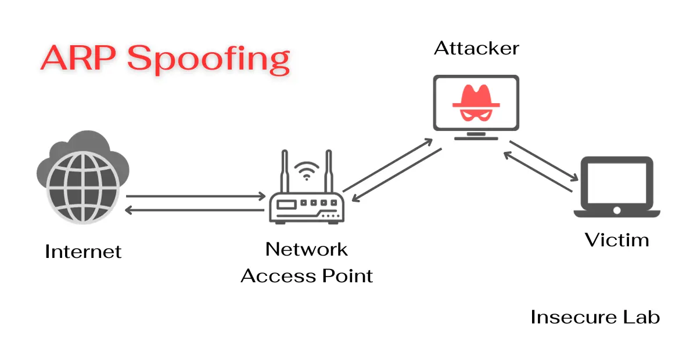
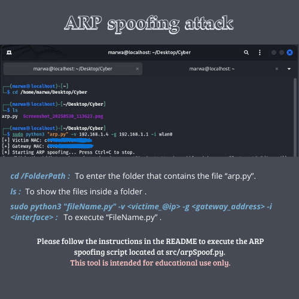

# 🔥 ARP Spoofing Tool (Educational Purpose Only)

<p align="center">
  
</p>

---

This project is a simple **ARP spoofing / ARP poisoning tool** written in Python using **Scapy**.  
It demonstrates how attackers can manipulate the ARP table of a victim and gateway to perform **Man-in-the-Middle (MITM)** attacks.

⚠️ **Disclaimer:**  
This tool is created for **educational and research purposes only**.  
Do **NOT** use it on networks without proper authorization. Unauthorized use is **illegal**.

---

## 📌 Features
- Retrieve MAC addresses of target and gateway automatically.  
- Send **fake ARP replies** to poison the ARP table of victim and gateway.  
- Restore original ARP tables on exit (Ctrl+C).  
- Supports specifying victim MAC manually.  

---

## ⚙️ Requirements
- Python **3.x**
- [Scapy](https://scapy.readthedocs.io/)

Install Scapy with:
```bash
pip install scapy
```
---

## 🚀 Usage

Clone the repository:
```bash
git clone https://github.com/BenkabaMarwa/arp-spoof-tool.git
cd arp-spoof-tool
```


Run the script with sudo/root privileges:
```bash
sudo python3 src/arpSpoof.py -v <victim_ip> -g <gateway_ip> -i <interface>
```
Example:
```bash
sudo python3 src/arpSpoof.py -v 192.168.1.12 -g 192.168.1.1 -i wlan0
```
If you already know the victim MAC:
```bash
sudo python3 src/arpSpoof.py -v 192.168.1.12 -m 11:22:33:44:55:66 -g 192.168.1.1 -i wlan0
```
Stop: Press Ctrl+C — the script will attempt to restore original ARP entries before exiting.

## 🔑 ARP Spoofing Attack



---

## 🛡️ How It Works

Sends ARP replies to the victim making it think the attacker is the gateway.

Sends ARP replies to the gateway making it think the attacker is the victim.

Maintains the poisoning by sending ARP packets every few seconds.

On exit, restores the original ARP tables.

---

## 📖 Educational Notes

ARP spoofing is used in Man-in-the-Middle attacks.

It allows attackers to intercept, modify, or block traffic.

This script is intended to help students and researchers understand ARP poisoning.

---

## 📝 License

This project is licensed under the MIT License.
Use responsibly.

👩‍💻 Author

Developed by Marwa Benkaba ✨
